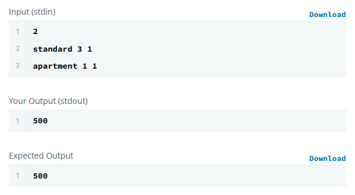
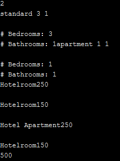
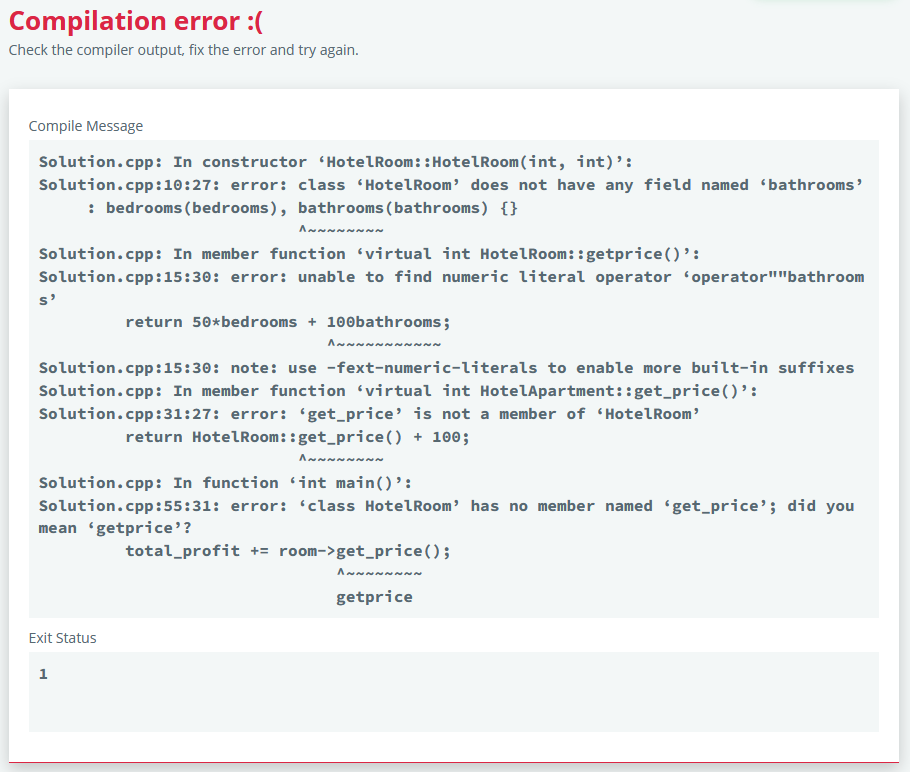
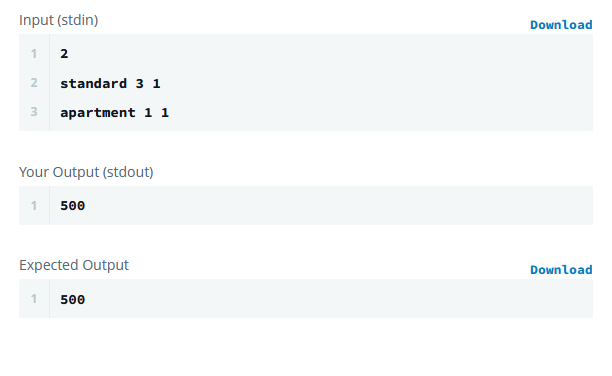

# Coding Challenge 3 - Big Dicks Halfway Inn
Challenge: Richard runs an inn, and he needs your help! In this challenge, the task is to debug the provided code to successfully execute all provided main tests.

The given code defines two classes HotelRoom and HotelApartment denoting respectively a standard hotel room and a hotel apartment. An instance of any of these classes has two parameters: bedrooms and bathrooms denoting respectively the number of bedrooms and the number of bathrooms in the room.

The prices of a standard hotel room and hotel apartment are given as:
    Hotel Room:  50 per bedroom + 100 per bathroom
    Hotel Apartment: The price of a standard room with the same number bedrooms and bathrooms plus 100

For example, if a standard room costs 200, then an apartment with the same number of bedrooms and bathrooms costs 300.

In Richard's codebase, there is a piece of code reading the list of rooms booked for today and calculates the total profit for the hotel. However, sometimes calculated profits are lower than they should be. Richard HATES this. He killed the last developer and now it's your job to fix his code. He has just one stipulation - DO NOT EDIT THE MAIN FUNCTION.

Debug the existing HotelRoom and HotelApartment class implementations so that the existing code returns a correct profit.

## Everyone
**Pros**
1. Solved the challenge
1. Didn't edit main

**Cons**
1. 

## Romulus
```cpp
#include <iostream>
#include <vector>

using namespace std;

// The following #if statement is a preprocessor definition, allows you to pre-process code, for this example we can test two implementations in our code but with one actually being compiled. Depends if the #if statement is true or false.
// The first will be an obvious approach using the "protected" access modifier,
// the second using "virtual" and "override" keywords, very useful in object orientated code. 

#if 0 // Most obvious approach
class HotelRoom 
{
public:
    HotelRoom(int bedrooms, int bathrooms) 
    : m_price((50*bedrooms) + (100*bathrooms)) {}

    int get_price()
    {
        return m_price;
    }
protected: // Protected means only accessable by itself and child inheritence classes
    int m_price;
};

class HotelApartment : public HotelRoom 
{
public:
    HotelApartment(int bedrooms, int bathrooms) 
    : HotelRoom(bedrooms, bathrooms) 
    {
        m_price += 100;
    }  
};

#else // Using virtual and override
class HotelRoom 
{
public:
    HotelRoom(int bedrooms, int bathrooms) 
    : m_bedrooms(bedrooms), m_bathrooms(bathrooms) {}
    
    virtual int get_price() 
    {
        return 50*m_bedrooms + 100*m_bathrooms;
    }
private:
    int m_bedrooms;
    int m_bathrooms;
};

class HotelApartment : public HotelRoom 
{
public:
    HotelApartment(int bedrooms, int bathrooms) 
    : HotelRoom(bedrooms, bathrooms) {}

    int get_price() override
    {
        return this->HotelRoom::get_price() + 100;
    }
};
#endif
```
Sample Output: 

**Pros**
1. Renamed variables to use hungarian notation e.g. m_bedroom to show it's a member variable
1. 

**Cons**
1. 

## Matt
```cpp
#include <iostream>
#include <vector>
#include <assert.h> 

using namespace std;

class HotelRoom {
public:
    HotelRoom(int bedrooms, int bathrooms)
    {
        //Exception check block to check arguments:
        try {
            if (bedrooms >= 0) {
                bedrooms_ = bedrooms;
            }
            else throw "\n# bedrooms can't be negative!\n";
            if (bathrooms >= 0) {
                bathrooms_ = bathrooms;
            }
            else throw "\n# bathrooms can't be negative!\n";
        }
        catch (const char* msg) {
            cerr << msg << endl;    //Spit the error message to console.
            assert(bedrooms >= 0);  //Assertion will terminate execution,
            assert(bathrooms >= 0); //and also return line number in console.
        }
        //Output to console:
        cout << "\n# Bedrooms: " << bedrooms_;
        cout << "\n# Bathrooms: " << bathrooms_;
    }

    virtual int get_price() {
        cout << "\nHotelroom" << 50 * bedrooms_ + 100 * bathrooms_ <<"\n";
        return 50 * bedrooms_ + 100 * bathrooms_;
    }

private:
    int bedrooms_;
    int bathrooms_;
};

class HotelApartment : public HotelRoom {
public:
    using HotelRoom::HotelRoom; //C++11 let's us inherit the parent's constructors like so.

    int get_price() {
        cout << "\nHotel Apartment" << HotelRoom::get_price() + 100 <<"\n";

        return HotelRoom::get_price() + 100;
    }
};
```
Sample Output: 

**Pros**
1. 

**Cons**
1. 

## Trevor
```cpp
#include <iostream>
#include <vector>

using namespace std;

/// <summary>Class for a standard Hotel Room.  Contains private bedroom & bathroom variables and a function which calculates the prive</summary>
class HotelRoom {
public:
    HotelRoom(int bedrooms, int bathrooms) 
    : bedrooms(bedrooms), bathrooms(bathrooms) {}

    /// <summary>Calculates the cost of the room as a function of bedrroms & bathrooms</summary>
    /// <returns>Cost of the room</returns>
    virtual int getprice() {
        return 50*bedrooms + 100bathrooms;
    }
private:
    int bedrooms;
    int bathrooms_;
};

/// <summary>Class for a hotel apartment which inherits the standard hotel room class</summary>
class HotelApartment : public HotelRoom {
public:
    HotelApartment(int bedrooms, int bathrooms) 
    : HotelRoom(bedrooms, bathrooms) {}

    /// <summary>Calculates the cost of the apartment using standard hotel room price function</summary>
    /// <returns>Cost of the room</returns>
    virtual int get_price() {
        return HotelRoom::get_price() + 100;
    }
};
```
Sample Output: 

**Pros**
1. Works for simple palindromes e.g. racecar

**Cons**
1. Gave two isPalindrome() functions
1. Couldn't follow the logic by reading the code
1. Variable names a serious problem - "input"
1. Fails on palindromic sentences
1. Fails on symbols for an unidentifiable reason
1. Doesn't account for capitals

## Jarek
```cpp
#include <iostream>
#include <vector>

using namespace std;

class HotelRoom {
public:
    HotelRoom(int bedrooms, int bathrooms) 
    : bedrooms_(bedrooms), bathrooms_(bathrooms) {}
    
    virtual int get_price() {
        const int total_room_price = calculate_base_room_price();
        return total_room_price;
    }
protected:
    virtual int calculate_base_room_price() {
        const int base_price = (bedrooms_ * BEDROOM_PRICE) + (bathrooms_ * BATHROOM_PRICE);
        return base_price;
    }
    
    const int BEDROOM_PRICE = 50;
    const int BATHROOM_PRICE = 100;
    int bedrooms_;
    int bathrooms_;
};

class HotelApartment : public HotelRoom {
public:
    HotelApartment(int bedrooms, int bathrooms) 
    : HotelRoom(bedrooms, bathrooms) {}

    int get_price() override {
        const int total_apt_price = calculate_base_room_price() + ADDITIONAL_APT_CHARGE;
        return total_apt_price;
    }
private:
    const int ADDITIONAL_APT_CHARGE = 100;
};
```
Sample Output: 

**Pros**
1. 

**Cons**
1. 